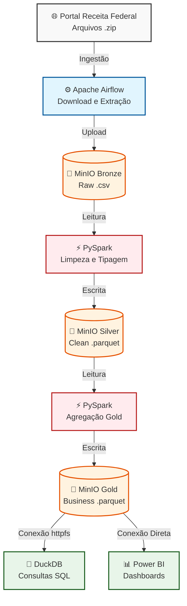

🚧 Aviso: Este projeto está atualmente em desenvolvimento ativo. A infraestrutura base já foi configurada e estou construindo os pipelines de ingestão e transformação etapa por etapa.

# 🏢 Projeto de Estudos: Data Lakehouse com Dados do CNPJ

Olá! Meu nome é Cleverson. Sou um profissional com mais de 15 anos de experiência em análise e desenvolvimento de sistemas (PHP, PL/SQL, bancos relacionais) e atualmente estou em **transição de carreira para a Engenharia de Dados**.

Este repositório contém o meu principal projeto prático. O objetivo aqui foi sair da teoria e construir um pipeline de **Big Data** do zero, processando os dados públicos da Receita Federal (que somam dezenas de gigabytes) usando uma infraestrutura local que simula o ambiente de nuvem.

## 🎯 O Desafio
Os dados públicos do CNPJ são pesados, divididos em múltiplos arquivos `.zip` e difíceis de manipular em ferramentas tradicionais (como o Excel ou bancos transacionais comuns). 

Meu desafio foi criar um processo automatizado para ingerir, limpar, transformar e disponibilizar esses dados para análises rápidas, aplicando o conceito de **Arquitetura Medalhão**.

### 🗂️ Fonte dos Dados
Os dados brutos processados neste pipeline são públicos, disponibilizados pela Receita Federal do Brasil e atualizados mensalmente.
- **Portal de Dados Abertos:** [Cadastro Nacional da Pessoa Jurídica - CNPJ](https://dados.gov.br/dados/conjuntos-dados/cadastro-nacional-da-pessoa-juridica---cnpj)
- **Formato de Origem:** Arquivos `.zip` contendo tabelas `.csv` com o cadastro completo de empresas, estabelecimentos, sócios e tabelas de domínio.

## 🛠️ Stack Tecnológico que estou estudando/aplicando

Como minha máquina local atua como o servidor, decidi usar o **Docker** para isolar e orquestrar os seguintes serviços:

* **Apache Airflow:** Para agendar e automatizar o download e a extração dos arquivos.
* **MinIO:** Para simular o Amazon S3 localmente (criando as camadas de armazenamento separadas do processamento).
* **Apache Spark (PySpark):** Para o processamento pesado e distribuído, lendo os CSVs e convertendo para o formato colunar Parquet.
* **DuckDB:** Para rodar consultas SQL analíticas em cima dos arquivos finais de forma quase instantânea.

## 🏗️ Como estruturei os dados (Arquitetura Medalhão)

- 🥉 **Bronze:** O Airflow baixa os Zips da Receita, extrai os CSVs e salva no MinIO exatamente como vieram (dados brutos).
- 🥈 **Silver:** O PySpark lê a Bronze, adiciona os cabeçalhos, tipa as colunas, trata nulos. Os dados são salvos em `.parquet`.
- 🥇 **Gold:** Agregações e cruzamentos (ex: Estabelecimentos + Municípios + CNAEs) para criar um modelo pronto para ferramentas de BI, como o Power BI.

### 🗺️ Diagrama da Arquitetura

## ⚙️ Como rodar na sua máquina

1. Clone o repositório: `git clone https://github.com/cleversonrocha/cnpj-data-lakehouse.git`
2. Configure as permissões criando um arquivo `.env` com a variável `AIRFLOW_UID=50000`.
3. Suba os containers com o Docker: `docker-compose up -d`
4. Acesse o MinIO em `localhost:9001` e crie os buckets `bronze`, `silver` e `gold`.
5. Acesse o Airflow em `localhost:8080` para iniciar as DAGs.

## 💻 Ambiente de Processamento Local (Hardware e Software)

Para suportar o processamento de dezenas de gigabytes de arquivos em uma arquitetura de Big Data local (simulando a nuvem), o projeto foi desenvolvido e executado na seguinte infraestrutura:

### Hardware Utilizado
- **Processador:** Intel Core i7-12700
- **Memória RAM:** 32GB (2x 16GB Kingston DDR4 3200MHz CL16)
- **Armazenamento:** SSD Kingston 1TB M.2 NVMe Gen4x4 (Leitura de 3500MB/s e Gravação de 2100MB/s)
- **GPU (Opcional para Analytics):** Placa de Vídeo Galax RTX 4060 8GB GDDR6
- **Placa Mãe:** Gigabyte Z690 UD M.2 DDR4
- **Refrigeração e Energia:** Water Cooler Corsair H100 240mm e Fonte Corsair CV750W 80Plus Bronze

Sinta-se à vontade para me dar feedbacks sobre o código!